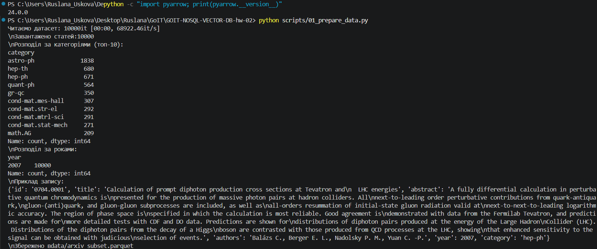
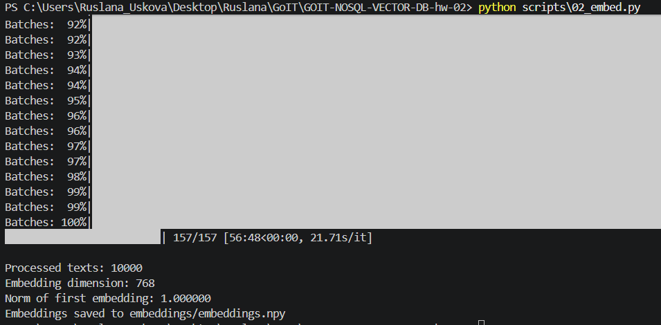
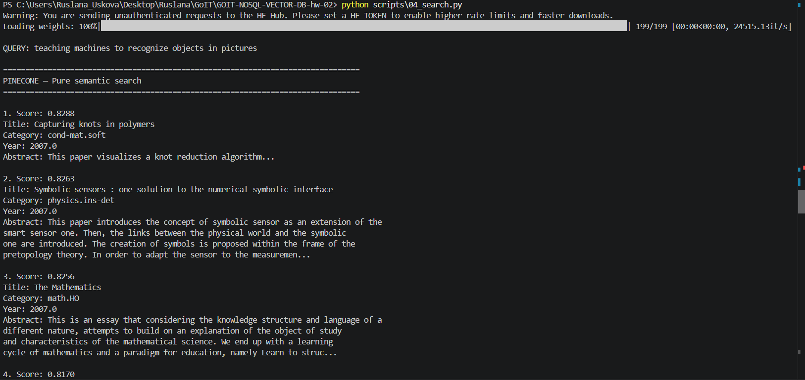
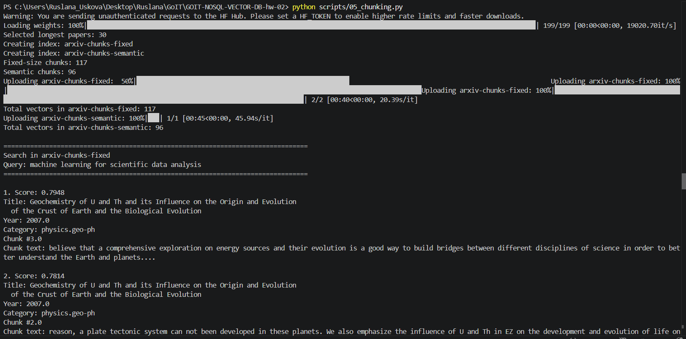

# GOIT NoSQL Vector DB Homework

## Використані технології

- Python
- Pinecone
- Sentence Transformers
- SPECTER2
- BM25
- NumPy
- Pandas

---

# Структура проєкту

```text
data/
    arxiv_subset.parquet

embeddings/
    embeddings.npy

scripts/
    01_prepare_data.py
    02_embed.py
    03_load_to_pinecone.py
    04_search.py
    05_chunking.py
    06_hybrid_search.py

README.md
requirements.txt
```

---

# ЗАВДАННЯ №1

## Результат виконання scripts/01_prepare_data.py


## Результат виконання scripts/02_embed.py



## 1. Чим Pinecone відрізняється від Qdrant і Chroma за моделлю розгортання, ліцензією і продуктивністю? У якому сценарії ви б обрали кожен із них?

Pinecone, Qdrant і Chroma є популярними векторними базами даних, однак вони відрізняються способом розгортання, ліцензією та сферою використання.

**Pinecone** — це повністю керований (managed) хмарний сервіс. Він не потребує власного сервера або адміністрування інфраструктури, автоматично масштабується та забезпечує високу продуктивність навіть для дуже великих колекцій векторів. Pinecone є комерційним продуктом із безкоштовним тарифом для невеликих проєктів.

**Qdrant** — це open-source векторна база даних, яку можна розгорнути локально або використовувати через Qdrant Cloud. Вона підтримує ефективний пошук найближчих сусідів, фільтрацію за метаданими та добре підходить для корпоративних систем, де необхідний контроль над інфраструктурою і даними.

**Chroma** також є open-source рішенням, але більше орієнтована на локальну розробку, навчання та швидке створення прототипів. Вона проста у використанні та добре інтегрується з популярними фреймворками для LLM, однак менш придатна для великих production-навантажень.

Я б обрала **Pinecone** для production-проєктів із великою кількістю користувачів та необхідністю масштабування, **Qdrant** — коли потрібне локальне розгортання та контроль над даними, а **Chroma** — для навчання, досліджень і невеликих експериментальних проєктів.

---

## 2. Чому для задачі пошуку по наукових текстах обрана модель specter2_base, а не універсальна all-MiniLM-L6-v2? Знайдіть картку моделі на HuggingFace і процитуйте, для яких задач вона навчена.

Для цього проєкту використовується модель **allenai/specter2_base**, оскільки вона спеціально навчена для роботи з науковими статтями. На відміну від універсальної моделі **all-MiniLM-L6-v2**, яка призначена для широкого спектра текстів, SPECTER2 враховує особливості наукових документів та їхні взаємозв'язки через систему цитувань. Завдяки цьому модель краще знаходить тематично схожі роботи навіть тоді, коли вони використовують різну термінологію.

У картці моделі на Hugging Face зазначено:

> *"SPECTER2 is intended to generate embeddings for scientific documents and queries for retrieval and search tasks."*

Також автори рекомендують використовувати як вхідний текст формат:

```
title [SEP] abstract
```

Саме тому в цьому проєкті заголовок і анотація об'єднуються за допомогою спеціального токена **[SEP]** перед генерацією ембеддингів.

Таким чином, використання **SPECTER2** забезпечує значно кращу якість семантичного пошуку серед наукових статей, ніж універсальні моделі ембеддингів.

---

## 3. Що написано у картці моделі про рекомендовану метрику схожості? Чому це важливо при створенні індексу?

У документації моделі SPECTER2 рекомендується використовувати **dot product** як метрику порівняння ембеддингів після їх нормалізації. Саме ця метрика відповідає способу навчання моделі та забезпечує найкращу якість пошуку.

Правильний вибір метрики є дуже важливим під час створення індексу у Pinecone. Якщо використовувати іншу метрику, яка не відповідає рекомендаціям моделі, результати пошуку можуть бути менш точними, а релевантні документи можуть отримувати нижчі позиції у видачі.

Саме тому під час створення індексу в цьому проєкті була використана метрика **dotproduct**, що відповідає рекомендаціям авторів моделі та дозволяє отримати максимально якісний семантичний пошук.

---

## 4. Поясніть, чому при використанні нормалізованих ембеддингів (одиничної довжини) косинусна схожість (cosine similarity) еквівалентна скалярному добутку (dot product).

Косинусна схожість між двома векторами визначається за формулою:

\[
\text{cosine}(A,B)=\frac{A\cdot B}{||A||\times||B||}
\]

Під час створення ембеддингів у цьому проєкті використовувався параметр:

```python
normalize_embeddings=True
```

Це означає, що кожен ембеддинг має одиничну довжину:

\[
||A||=1,\qquad ||B||=1
\]

У такому випадку знаменник формули дорівнює одиниці, тому вона спрощується до:

\[
\text{cosine}(A,B)=A\cdot B
\]


# ЗАВДАННЯ №2

## Результат виконання 03_load_to_pinecone.py


# ЗАВДАННЯ №3

## Результат виконання 04_search.py


## 1. Чи збігаються топ-5 для cosine і dot product і чому?

Так, у цьому проєкті топ-5 для cosine similarity і dot product мають збігатися або бути майже ідентичними. Причина в тому, що ембеддинги були створені з параметром `normalize_embeddings=True`, тобто кожен вектор має одиничну довжину. Для нормалізованих векторів формула cosine similarity спрощується до звичайного скалярного добутку, тому обидві метрики ранжують документи однаково.

## 2. Чи відрізняються результати для L2 і чому?

Для нормалізованих ембеддингів результати L2-distance зазвичай також дуже близькі до cosine і dot product, але порядок може трохи відрізнятися через числову точність та особливості сортування. L2-distance вимірює відстань між точками у векторному просторі: чим менша відстань, тим більш схожими є документи. Для одиничних векторів L2 математично пов’язана з dot product, тому результати часто схожі.

## 3. Що сталося б, якби ембеддинги не були нормалізовані?

Якби ембеддинги не були нормалізовані, cosine similarity і dot product могли б давати різні результати. Dot product враховував би не тільки напрямок векторів, а й їхню довжину, тому документи з більшими нормами могли б отримувати вищі scores навіть без кращої семантичної близькості. Cosine similarity у такому випадку залишалася б більш стабільною для порівняння змісту, бо вона нормалізує результат через довжини векторів.


# ЗАВДАННЯ №4

## Результат виконання 05_chunking.py


## 1. Яка стратегія дає більш осмислені чанки?

Semantic chunking дає більш осмислені чанки, тому що він розбиває текст за реченнями і намагається не розривати завершені думки. У такому підході кожен чанк зазвичай містить логічно пов’язаний фрагмент анотації. Fixed-size chunking простіший, але він орієнтується лише на кількість слів, тому може розрізати речення або змішувати частини різних смислових блоків.

## 2. Чи є випадки розрізаних речень і як це впливає на ембеддинги?

Так, у fixed-size chunking можливі випадки, коли речення розрізається посередині. Це може погіршити якість ембеддингу, тому що модель отримує неповний контекст. Через це вектор може гірше відображати зміст фрагмента. У semantic chunking таких випадків менше, бо текст спочатку ділиться на речення, а потім речення об’єднуються в чанки.

## 3. Як розмір overlap впливає на кількість чанків і покриття тексту?

Overlap збільшує кількість чанків, тому що частина слів повторюється між сусідніми фрагментами. Чим більший overlap, тим більше чанків буде створено і тим більше місця займатимуть дані в індексі. Водночас overlap покращує покриття тексту: якщо важлива думка знаходиться на межі двох чанків, вона не буде повністю втрачена, бо частина контексту повториться в наступному чанку.


# ЗАВДАННЯ №5

## Результат виконання 06_hybrid_search.py


## 1. Який метод дав кращий результат і чому?

Найкращий результат залежить від типу запиту. Для точних термінів, назв моделей, абревіатур або імен авторів краще працює BM25, тому що він шукає буквальні збіги слів у тексті. Для перефразованих запитів краще працює векторний пошук, бо він порівнює не окремі слова, а семантичну близькість між запитом і документами. Гібридний пошук через RRF зазвичай дає найбільш збалансований результат, бо поєднує переваги обох підходів.

## 2. Чи є документи в топ-5 гібридного пошуку, яких немає в топ-5 окремих методів, і чому?

Так, такі документи можуть з'являтися. У цьому скрипті для RRF береться ширший список результатів (`TOP_K = 10`) з BM25 і векторного пошуку, а потім вони об'єднуються. Документ може не входити в топ-5 жодного окремого методу, але бути, наприклад, на 6–7 місці в обох списках. Завдяки стабільно хорошим позиціям у двох різних ранжуваннях він може отримати високий сумарний RRF-score і потрапити в фінальний топ-5.

## 3. Як зміна параметра k в RRF впливає на видачу, наприклад k=60 vs k=1?

Параметр `k` у формулі RRF контролює, наскільки сильно враховується позиція документа в ранжованому списку. При великому значенні, наприклад `k=60`, різниця між 1-м і 10-м місцем згладжується, тому RRF більше винагороджує документи, які стабільно з'являються в кількох списках. При малому значенні, наприклад `k=1`, верхні позиції мають набагато більшу вагу, тому документ на 1-му місці в одному методі може сильно домінувати над документами, які нижче, навіть якщо вони присутні в обох списках.


## Порівняльна таблиця методів пошуку

| Запит | BM25 | Vector Search | Hybrid (RRF) |
|-------|------|---------------|--------------|
| **BERT fine-tuning** | Добре знаходить документи з точним збігом терміна (якщо вони є в корпусі). У моєму датасеті релевантних статей немає, оскільки він містить роботи переважно за 2007 рік. | Семантичний пошук також не знаходить релевантних результатів через відсутність статей про BERT. | Поєднує результати обох методів, але через особливості датасету не може повернути статті про BERT. |
| **Yann LeCun convolutional networks** | Найкраще працює, оскільки містить ім'я автора та точні терміни. | Може знайти тематично близькі статті навіть без точного збігу. | Дає найбільш збалансовану видачу, поєднуючи точні збіги та семантичну схожість. |
| **making computers understand human emotions from text** | Працює гірше, оскільки використовує перефразування без точних ключових слів. | Найкращий результат, оскільки знаходить документи за змістом запиту. | Забезпечує найкращу загальну якість, комбінуючи сильні сторони BM25 та векторного пошуку. |


# ЗАВДАННЯ №6

# Аналіз і висновки

## 1. Семантичний пошук vs BM25

Під час виконання роботи було реалізовано три варіанти пошуку: BM25, семантичний пошук за допомогою Pinecone та гібридний пошук (BM25 + векторний пошук через Reciprocal Rank Fusion). Результати показали, що кожен із методів має свої сильні сторони.

BM25 найкраще працює для запитів, які містять точні ключові слова, назви моделей, абревіатури або прізвища авторів. Наприклад, для запиту **"Yann LeCun convolutional networks"** цей метод шукає буквальні збіги слів у документах, тому швидко знаходить статті, де ці слова безпосередньо присутні. Аналогічно, запит **"BERT fine-tuning"** добре підходить для BM25, хоча в моєму датасеті статей 2007 року модель BERT ще не існувала, тому релевантних документів не було.

Семантичний пошук працює інакше: він не шукає буквальні збіги, а порівнює зміст запиту та документів у векторному просторі. Це особливо корисно для запитів, сформульованих природною мовою або у вигляді перефразування. Наприклад, запит **"making computers understand human emotions from text"** не містить точних назв алгоритмів, але векторний пошук може знайти статті, пов'язані з аналізом тексту, машинним навчанням або обробкою природної мови.

Гібридний пошук поєднує переваги обох методів. Якщо документ добре ранжується як BM25, так і векторним пошуком, він отримує високий RRF-score та піднімається у фінальному рейтингу. На практиці саме гібридний пошук зазвичай дає найбільш стабільні результати.

**Загальне правило:** BM25 доцільно використовувати для точних технічних запитів, назв моделей, авторів і абревіатур, а семантичний пошук — для природних формулювань, синонімів і перефразувань. Якщо є можливість, найкращим рішенням є використання гібридного пошуку.

---

## 2. Вплив розміру чанка

Розмір чанка безпосередньо впливає на якість пошуку та зміст ембеддингів.

Якщо чанк занадто маленький (приблизно 10–15 слів), він часто містить недостатньо інформації для формування повноцінного змісту. Модель отримує дуже обмежений контекст, через що ембеддинг може гірше відображати тему документа. Крім того, збільшується кількість чанків, що потребує більше місця в індексі та збільшує час пошуку.

Якщо ж чанк занадто великий (500 і більше слів), у ньому можуть змішуватися різні теми або кілька логічних частин документа. У результаті ембеддинг описує відразу кілька ідей, що зменшує точність пошуку. Крім того, дуже великі тексти можуть перевищувати максимальну довжину, яку ефективно обробляє модель ембеддингів.

У цій роботі використовувався розмір приблизно **120 слів**, що є хорошим компромісом між достатнім контекстом і точністю представлення. Однак універсального оптимального розміру не існує — він залежить від типу документів, моделі ембеддингів та конкретної задачі пошуку.

---

## 3. Невідповідна метрика

У цьому проєкті модель **allenai/specter2_base** використовувалася разом із параметром `normalize_embeddings=True`, тобто всі ембеддинги мають одиничну довжину. Саме тому при створенні індексу Pinecone була обрана метрика **dotproduct**, яку рекомендують автори моделі.

Якби індекс був створений з метрикою **euclidean (L2)**, пошук все одно працював би коректно, оскільки для одиничних векторів існує прямий математичний зв'язок між косинусною схожістю та евклідовою відстанню.

Для двох нормалізованих векторів **x** та **y**:

\[
||x|| = ||y|| = 1
\]

Квадрат евклідової відстані дорівнює:

\[
||x-y||^2 = ||x||^2 + ||y||^2 - 2(x \cdot y)
\]

Оскільки довжини обох векторів рівні одиниці, формула спрощується:

\[
||x-y||^2 = 2 - 2(x \cdot y)
\]

Для нормалізованих векторів:

\[
x \cdot y = \cos(\theta)
\]

Отже,

\[
||x-y||^2 = 2 - 2\cos(\theta)
\]

Це означає, що L2-distance та cosine similarity монотонно пов'язані між собою і практично однаково ранжують документи. Проте використання рекомендованої метрики **dotproduct** є правильнішим рішенням, оскільки саме під неї навчалася модель SPECTER2.

---

## 4. Обмеження Pinecone Starter

Під час виконання роботи використовувався безкоштовний тариф Pinecone Starter. Для датасету з 10 000 статей його можливостей було достатньо, однак безкоштовний тариф має низку обмежень. Насамперед це обмеження на обсяг збережених векторів, доступні ресурси, швидкість обробки запитів та кількість індексів. Також Starter не призначений для високонавантажених production-систем із великою кількістю одночасних користувачів.

Якби необхідно було працювати не з 10 тисячами, а з **10 мільйонами статей**, поточного рішення було б недостатньо. У такому випадку доцільно використовувати платний тариф Pinecone або власне розгортання векторної бази даних, наприклад Qdrant чи Milvus. Завантаження даних виконувалося б пакетами, а сам індекс бажано розділити за категоріями або часовими періодами. Для пришвидшення пошуку також можна застосовувати багаторівневу архітектуру: спочатку відбирати кандидатів за допомогою BM25 або фільтрації за метаданими, а потім виконувати точний семантичний пошук лише серед відібраних документів. Такий підхід дозволяє ефективно працювати навіть із дуже великими колекціями документів.